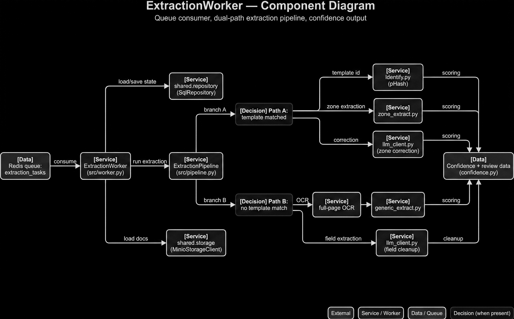

# D04 — ExtractionWorker Component Diagram

```text
SYSTEM ROLE:
You are a senior information designer generating one enterprise architecture/flow diagram.

HARD OUTPUT RULES:
- Output exactly ONE diagram image (no collage, no variants, no watermark).
- Style: clean flat vector, professional consulting-deck quality.
- No 3D, no photos, no clipart, no skeuomorphism.
- Background: pure white (#FFFFFF).
- Aspect: 16:10.
- If text overflow risk exists, increase canvas before reducing font size.

CANVAS TIERS:
- Default: 2800x1750
- If overflow persists: 3200x2000
- Never go below 2400x1500
- Never reduce body font below 16 px

TYPOGRAPHY:
- Sans-serif (Inter/Helvetica/Roboto style)
- Title: 48 px semibold
- Subtitle: 26 px regular
- Node title/body: 20/17 px
- Edge labels: 16 px
- Text color primary #111111, secondary #444444

VISUAL TOKENS:
- Border stroke: #1F1F1F (1.6 px)
- Connector stroke: #2A2A2A (1.6 px), orthogonal routing only
- Arrowheads: filled, clear direction
- External actor fill: #F7F7F7
- Service/worker fill: #ECECEC
- Data store/queue fill: #E2E2E2
- Decision fill: #F1F1F1
- Annotation fill: #FAFAFA
- Corner radius: 12 px
- Minimal shadow only if needed for separation

LAYOUT CONSTRAINTS:
- Outer margin: 96 px
- Min node-to-node gap: 56 px
- Min lane gap: 72 px
- Keep labels fully visible; wrap text intentionally using provided line breaks.
- Avoid line crossings. If crossing risk appears, reroute connectors with elbows.

LEGEND (bottom-right, fixed text):
- External
- Service / Worker
- Data / Queue
- Decision (when present)

STRICT CONTENT RULES:
- Use exact node names and exact edge labels from the spec.
- Do not rename, abbreviate, or invent components.
- Do not add extra nodes unless explicitly listed as annotations.
- Keep title and subtitle exact.

FINAL QA (must pass):
1) No overlaps
2) No clipped text
3) No ambiguous arrows
4) Every listed node appears once
5) Every listed edge appears once

ID: D04
TITLE: ExtractionWorker — Component Diagram
SUBTITLE: Queue consumer, dual-path extraction pipeline, confidence output
CANVAS: 3200x2000
LAYOUT: Left-to-right with two parallel branch lanes reconverging

NODES:
- [Data] Redis queue:\nextraction_tasks
- [Service] ExtractionWorker\n(src/worker.py)
- [Service] shared.repository\n(SqlRepository)
- [Service] shared.storage\n(MinioStorageClient)
- [Service] ExtractionPipeline\n(src/pipeline.py)
- [Decision] Path A:\ntemplate matched
- [Service] identify.py\n(pHash)
- [Service] zone_extract.py
- [Service] llm_client.py\n(zone correction)
- [Decision] Path B:\nno template match
- [Service] full-page OCR
- [Service] generic_extract.py
- [Service] llm_client.py\n(field cleanup)
- [Data] Confidence + review data\n(confidence.py)

EDGES:
1) Redis queue:\nextraction_tasks -> ExtractionWorker\n(src/worker.py) | consume
2) ExtractionWorker\n(src/worker.py) -> shared.repository\n(SqlRepository) | load/save state
3) ExtractionWorker\n(src/worker.py) -> shared.storage\n(MinioStorageClient) | load docs
4) ExtractionWorker\n(src/worker.py) -> ExtractionPipeline\n(src/pipeline.py) | run extraction
5) ExtractionPipeline\n(src/pipeline.py) -> Path A:\ntemplate matched | branch A
6) Path A:\ntemplate matched -> identify.py\n(pHash) | template id
7) Path A:\ntemplate matched -> zone_extract.py | zone extraction
8) Path A:\ntemplate matched -> llm_client.py\n(zone correction) | correction
9) ExtractionPipeline\n(src/pipeline.py) -> Path B:\nno template match | branch B
10) Path B:\nno template match -> full-page OCR | OCR
11) Path B:\nno template match -> generic_extract.py | field extraction
12) Path B:\nno template match -> llm_client.py\n(field cleanup) | cleanup
13) Path A:\ntemplate matched -> Confidence + review data\n(confidence.py) | scoring
14) Path B:\nno template match -> Confidence + review data\n(confidence.py) | scoring
```

## Generated Output


