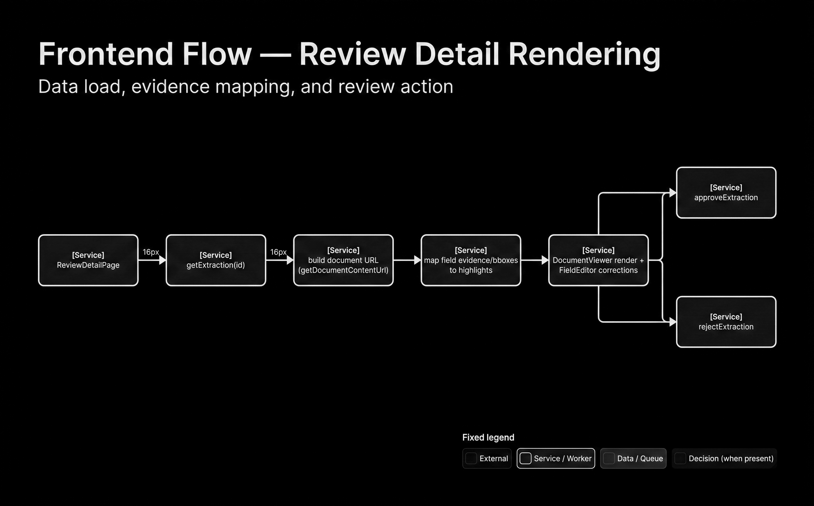

# D05 — OcrEngine Redis RPC Diagram

```text
SYSTEM ROLE:
You are a senior information designer generating one enterprise architecture/flow diagram.

HARD OUTPUT RULES:
- Output exactly ONE diagram image (no collage, no variants, no watermark).
- Style: clean flat vector, professional consulting-deck quality.
- No 3D, no photos, no clipart, no skeuomorphism.
- Background: pure white (#FFFFFF).
- Aspect: 16:10.
- If text overflow risk exists, increase canvas before reducing font size.

CANVAS TIERS:
- Default: 2800x1750
- If overflow persists: 3200x2000
- Never go below 2400x1500
- Never reduce body font below 16 px

TYPOGRAPHY:
- Sans-serif (Inter/Helvetica/Roboto style)
- Title: 48 px semibold
- Subtitle: 26 px regular
- Node title/body: 20/17 px
- Edge labels: 16 px
- Text color primary #111111, secondary #444444

VISUAL TOKENS:
- Border stroke: #1F1F1F (1.6 px)
- Connector stroke: #2A2A2A (1.6 px), orthogonal routing only
- Arrowheads: filled, clear direction
- External actor fill: #F7F7F7
- Service/worker fill: #ECECEC
- Data store/queue fill: #E2E2E2
- Decision fill: #F1F1F1
- Annotation fill: #FAFAFA
- Corner radius: 12 px
- Minimal shadow only if needed for separation

LAYOUT CONSTRAINTS:
- Outer margin: 96 px
- Min node-to-node gap: 56 px
- Min lane gap: 72 px
- Keep labels fully visible; wrap text intentionally using provided line breaks.
- Avoid line crossings. If crossing risk appears, reroute connectors with elbows.

LEGEND (bottom-right, fixed text):
- External
- Service / Worker
- Data / Queue
- Decision (when present)

STRICT CONTENT RULES:
- Use exact node names and exact edge labels from the spec.
- Do not rename, abbreviate, or invent components.
- Do not add extra nodes unless explicitly listed as annotations.
- Keep title and subtitle exact.

FINAL QA (must pass):
1) No overlaps
2) No clipped text
3) No ambiguous arrows
4) Every listed node appears once
5) Every listed edge appears once

ID: D05
TITLE: OcrEngine — Redis OCR RPC Architecture
SUBTITLE: Task queue consumption and short-lived result publishing
CANVAS: 2800x1750
LAYOUT: Producer/Redis/Worker topology + worker internal step strip

NODES:
- [Service] ExtractionWorker\n(RedisOcrClient)
- [Data] Redis
- [Service] OcrEngine Worker\n(src/worker.py)
- [Service] BLPOP ocr_tasks
- [Service] deserialize_ocr_request(...)
- [Service] ocr_service.ocr_region(...)
- [Service] serialize_ocr_result(...)
- [Service] SETEX ocr_results:{request_id}\n300

EDGES:
1) ExtractionWorker\n(RedisOcrClient) -> Redis | RPUSH ocr_tasks
2) Redis -> OcrEngine Worker\n(src/worker.py) | BLPOP ocr_tasks
3) OcrEngine Worker\n(src/worker.py) -> Redis | SETEX ocr_results:{request_id} 300
4) ExtractionWorker\n(RedisOcrClient) -> Redis | GET/DELETE ocr_results:{request_id}

INTERNAL FLOW (inside OcrEngine Worker panel):
BLPOP ocr_tasks -> deserialize_ocr_request(...) -> ocr_service.ocr_region(...) -> serialize_ocr_result(...) -> SETEX ocr_results:{request_id} 300
```

## Generated Output


