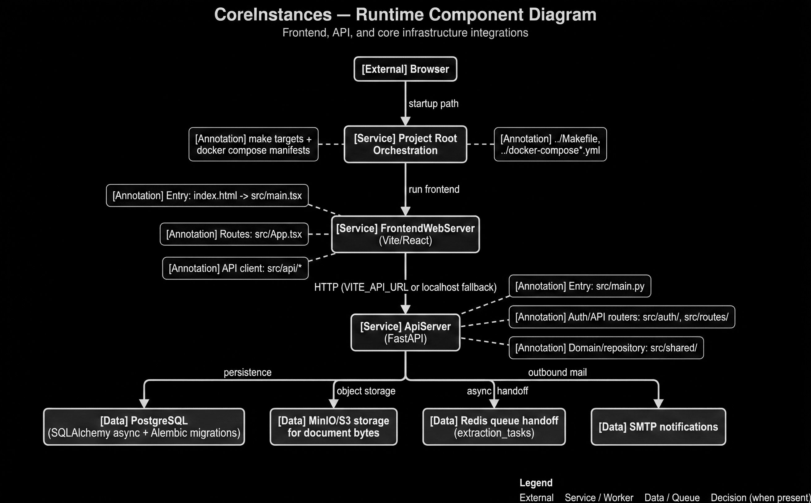

# D07 — CoreInstances Runtime Diagram

```text
SYSTEM ROLE:
You are a senior information designer generating one enterprise architecture/flow diagram.

HARD OUTPUT RULES:
- Output exactly ONE diagram image (no collage, no variants, no watermark).
- Style: clean flat vector, professional consulting-deck quality.
- No 3D, no photos, no clipart, no skeuomorphism.
- Background: pure white (#FFFFFF).
- Aspect: 16:10.
- If text overflow risk exists, increase canvas before reducing font size.

CANVAS TIERS:
- Default: 2800x1750
- If overflow persists: 3200x2000
- Never go below 2400x1500
- Never reduce body font below 16 px

TYPOGRAPHY:
- Sans-serif (Inter/Helvetica/Roboto style)
- Title: 48 px semibold
- Subtitle: 26 px regular
- Node title/body: 20/17 px
- Edge labels: 16 px
- Text color primary #111111, secondary #444444

VISUAL TOKENS:
- Border stroke: #1F1F1F (1.6 px)
- Connector stroke: #2A2A2A (1.6 px), orthogonal routing only
- Arrowheads: filled, clear direction
- External actor fill: #F7F7F7
- Service/worker fill: #ECECEC
- Data store/queue fill: #E2E2E2
- Decision fill: #F1F1F1
- Annotation fill: #FAFAFA
- Corner radius: 12 px
- Minimal shadow only if needed for separation

LAYOUT CONSTRAINTS:
- Outer margin: 96 px
- Min node-to-node gap: 56 px
- Min lane gap: 72 px
- Keep labels fully visible; wrap text intentionally using provided line breaks.
- Avoid line crossings. If crossing risk appears, reroute connectors with elbows.

LEGEND (bottom-right, fixed text):
- External
- Service / Worker
- Data / Queue
- Decision (when present)

STRICT CONTENT RULES:
- Use exact node names and exact edge labels from the spec.
- Do not rename, abbreviate, or invent components.
- Do not add extra nodes unless explicitly listed as annotations.
- Keep title and subtitle exact.

FINAL QA (must pass):
1) No overlaps
2) No clipped text
3) No ambiguous arrows
4) Every listed node appears once
5) Every listed edge appears once

ID: D07
TITLE: CoreInstances — Runtime Component Diagram
SUBTITLE: Frontend, API, and core infrastructure integrations
CANVAS: 3200x2000
LAYOUT: Top-down with ApiServer hub and side dependencies

NODES:
- [External] Browser
- [Service] Project Root\nOrchestration
- [Service] FrontendWebServer\n(Vite/React)
- [Service] ApiServer\n(FastAPI)
- [Data] PostgreSQL\n(SQLAlchemy async + Alembic migrations)
- [Data] MinIO/S3 storage\nfor document bytes
- [Data] Redis queue handoff\n(extraction_tasks)
- [Data] SMTP notifications
- [Annotation] make targets +\ndocker compose manifests
- [Annotation] ../Makefile,\n../docker-compose*.yml
- [Annotation] Entry: index.html -> src/main.tsx
- [Annotation] Routes: src/App.tsx
- [Annotation] API client: src/api/*
- [Annotation] Entry: src/main.py
- [Annotation] Auth/API routers: src/auth/, src/routes/
- [Annotation] Domain/repository: src/shared/

EDGES:
1) Browser -> Project Root\nOrchestration | startup path
2) Project Root\nOrchestration -> FrontendWebServer\n(Vite/React) | run frontend
3) FrontendWebServer\n(Vite/React) -> ApiServer\n(FastAPI) | HTTP (VITE_API_URL or localhost fallback)
4) ApiServer\n(FastAPI) -> PostgreSQL\n(SQLAlchemy async + Alembic migrations) | persistence
5) ApiServer\n(FastAPI) -> MinIO/S3 storage\nfor document bytes | object storage
6) ApiServer\n(FastAPI) -> Redis queue handoff\n(extraction_tasks) | async handoff
7) ApiServer\n(FastAPI) -> SMTP notifications | outbound mail

ANNOTATION LINKS:
- make targets +\ndocker compose manifests -> Project Root\nOrchestration (dashed)
- ../Makefile,\n../docker-compose*.yml -> Project Root\nOrchestration (dashed)
- Entry: index.html -> src/main.tsx -> FrontendWebServer\n(Vite/React) (dashed)
- Routes: src/App.tsx -> FrontendWebServer\n(Vite/React) (dashed)
- API client: src/api/* -> FrontendWebServer\n(Vite/React) (dashed)
- Entry: src/main.py -> ApiServer\n(FastAPI) (dashed)
- Auth/API routers: src/auth/, src/routes/ -> ApiServer\n(FastAPI) (dashed)
- Domain/repository: src/shared/ -> ApiServer\n(FastAPI) (dashed)
```

## Generated Output


