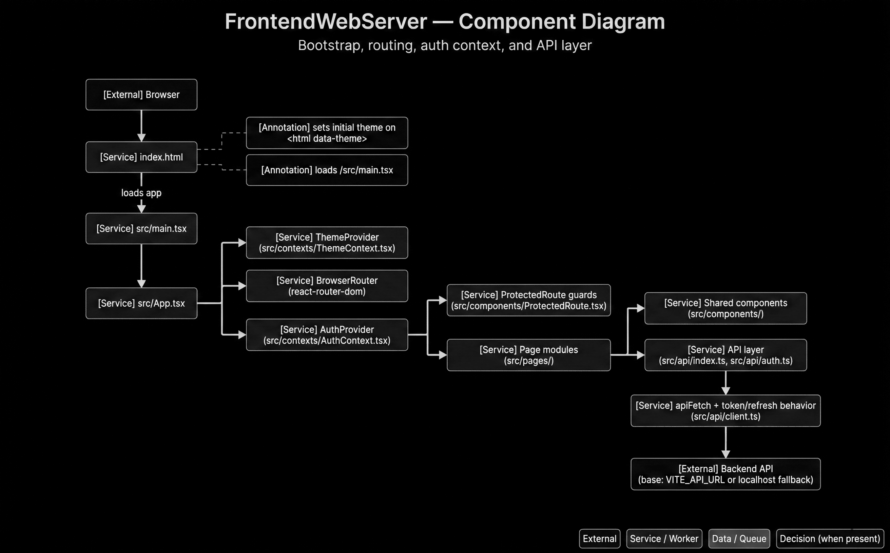

# D08 — Frontend Component Diagram

```text
SYSTEM ROLE:
You are a senior information designer generating one enterprise architecture/flow diagram.

HARD OUTPUT RULES:
- Output exactly ONE diagram image (no collage, no variants, no watermark).
- Style: clean flat vector, professional consulting-deck quality.
- No 3D, no photos, no clipart, no skeuomorphism.
- Background: pure white (#FFFFFF).
- Aspect: 16:10.
- If text overflow risk exists, increase canvas before reducing font size.

CANVAS TIERS:
- Default: 2800x1750
- If overflow persists: 3200x2000
- Never go below 2400x1500
- Never reduce body font below 16 px

TYPOGRAPHY:
- Sans-serif (Inter/Helvetica/Roboto style)
- Title: 48 px semibold
- Subtitle: 26 px regular
- Node title/body: 20/17 px
- Edge labels: 16 px
- Text color primary #111111, secondary #444444

VISUAL TOKENS:
- Border stroke: #1F1F1F (1.6 px)
- Connector stroke: #2A2A2A (1.6 px), orthogonal routing only
- Arrowheads: filled, clear direction
- External actor fill: #F7F7F7
- Service/worker fill: #ECECEC
- Data store/queue fill: #E2E2E2
- Decision fill: #F1F1F1
- Annotation fill: #FAFAFA
- Corner radius: 12 px
- Minimal shadow only if needed for separation

LAYOUT CONSTRAINTS:
- Outer margin: 96 px
- Min node-to-node gap: 56 px
- Min lane gap: 72 px
- Keep labels fully visible; wrap text intentionally using provided line breaks.
- Avoid line crossings. If crossing risk appears, reroute connectors with elbows.

LEGEND (bottom-right, fixed text):
- External
- Service / Worker
- Data / Queue
- Decision (when present)

STRICT CONTENT RULES:
- Use exact node names and exact edge labels from the spec.
- Do not rename, abbreviate, or invent components.
- Do not add extra nodes unless explicitly listed as annotations.
- Keep title and subtitle exact.

FINAL QA (must pass):
1) No overlaps
2) No clipped text
3) No ambiguous arrows
4) Every listed node appears once
5) Every listed edge appears once

ID: D08
TITLE: FrontendWebServer — Component Diagram
SUBTITLE: Bootstrap, routing, auth context, and API layer
CANVAS: 3200x2000
LAYOUT: Vertical main spine with right-side decomposition

NODES:
- [External] Browser
- [Service] index.html
- [Annotation] sets initial theme on\n<html data-theme>
- [Annotation] loads /src/main.tsx
- [Service] src/main.tsx
- [Service] src/App.tsx
- [Service] ThemeProvider\n(src/contexts/ThemeContext.tsx)
- [Service] BrowserRouter\n(react-router-dom)
- [Service] AuthProvider\n(src/contexts/AuthContext.tsx)
- [Service] ProtectedRoute guards\n(src/components/ProtectedRoute.tsx)
- [Service] Page modules\n(src/pages/)
- [Service] Shared components\n(src/components/)
- [Service] API layer\n(src/api/index.ts, src/api/auth.ts)
- [Service] apiFetch + token/refresh behavior\n(src/api/client.ts)
- [External] Backend API\n(base: VITE_API_URL or localhost fallback)

EDGES:
1) Browser -> index.html
2) index.html -> src/main.tsx | loads app
3) src/main.tsx -> src/App.tsx
4) src/App.tsx -> ThemeProvider\n(src/contexts/ThemeContext.tsx)
5) src/App.tsx -> BrowserRouter\n(react-router-dom)
6) src/App.tsx -> AuthProvider\n(src/contexts/AuthContext.tsx)
7) AuthProvider\n(src/contexts/AuthContext.tsx) -> ProtectedRoute guards\n(src/components/ProtectedRoute.tsx)
8) AuthProvider\n(src/contexts/AuthContext.tsx) -> Page modules\n(src/pages/)
9) Page modules\n(src/pages/) -> Shared components\n(src/components/)
10) Page modules\n(src/pages/) -> API layer\n(src/api/index.ts, src/api/auth.ts)
11) API layer\n(src/api/index.ts, src/api/auth.ts) -> apiFetch + token/refresh behavior\n(src/api/client.ts)
12) apiFetch + token/refresh behavior\n(src/api/client.ts) -> Backend API\n(base: VITE_API_URL or localhost fallback)

ANNOTATION LINKS:
- sets initial theme on\n<html data-theme> -> index.html (dashed)
- loads /src/main.tsx -> index.html (dashed)
```

## Generated Output


